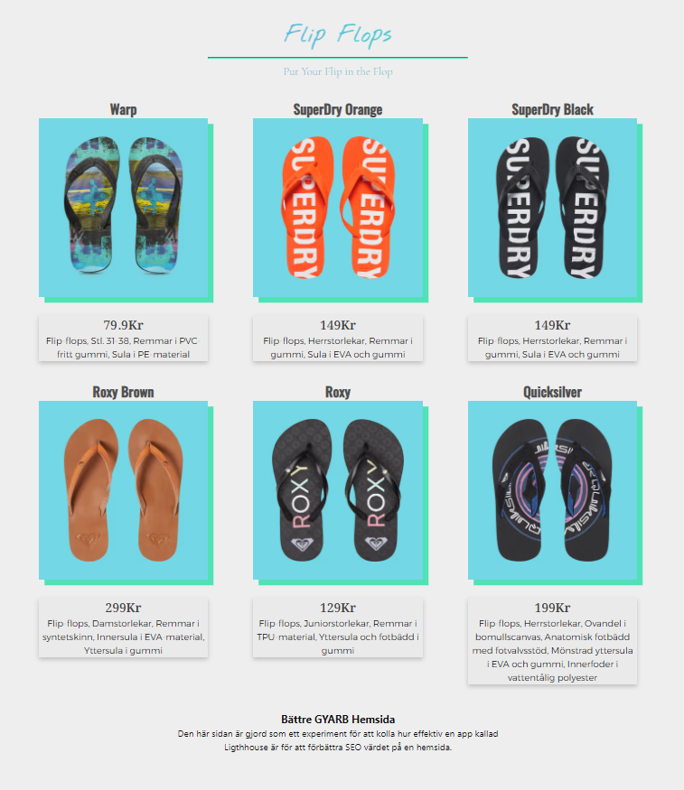
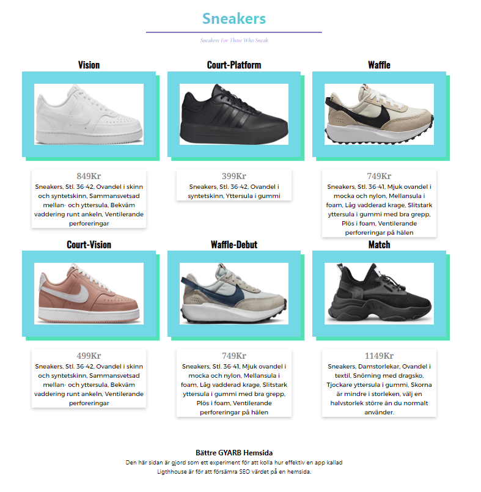

# GYARB

## Bra hemsidan
https://flipflops.timpan.ninja/

### Vad gör denna sida bättre?
När man kollar på Lightouse så har denna sida ett värde på 100 prestanda, 100 tillgänlighet, 92 bästa metoder och 100 SEO. Dessa värden från Lightouse visar att sidan är gjord på ett bra sätt utfirån deras kalkylationer. Den är också anpassad för mobiltelefoner så der gör den bättre. 

## Sämre hemsidan
https://sneakers.timpan.ninja/

### Vad gör denna sida sämre?
När man kollar på den här sidan via Lightouse så har den ett värde på 27 prestanda, 89 tillgänlighet, 83 bästa metoder och 73 SEO. Den här sidan är ej anpassad för mobiltelefon. 

## Varför gjorde jag sidorna på detta sätt?
Jag har gjort dessa sidor utifrån samma design men har gjort en sida bättre och en sida sämre. Allt detta är tillför att kolla hur sidans olika värden utifrån Lightouse påverkar Googles SEO. Sidorna har samma funktioner och mycket likt innehåll men för att innehållet inte skulle kråcka med varandra så har jag två olika typer av fotbeklädnad. Den bättre hemsidan är gjord med bättre, effektivare och mer optimerad HTML kod för att skapa en hemsida om produkter. Koden jag använde är 11ty, då skapar man först en json fil med data för produkterna och när man är klar så skriver gör man en loop där man kan skriva t.ex {{ product.name }} som kommer skriva ut alla produkterns namn i ordning. Medans med sämre hemsidan så har jag försökt att göra den med mindre effektiv HTML kod.